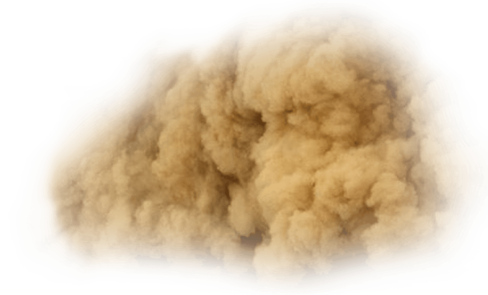
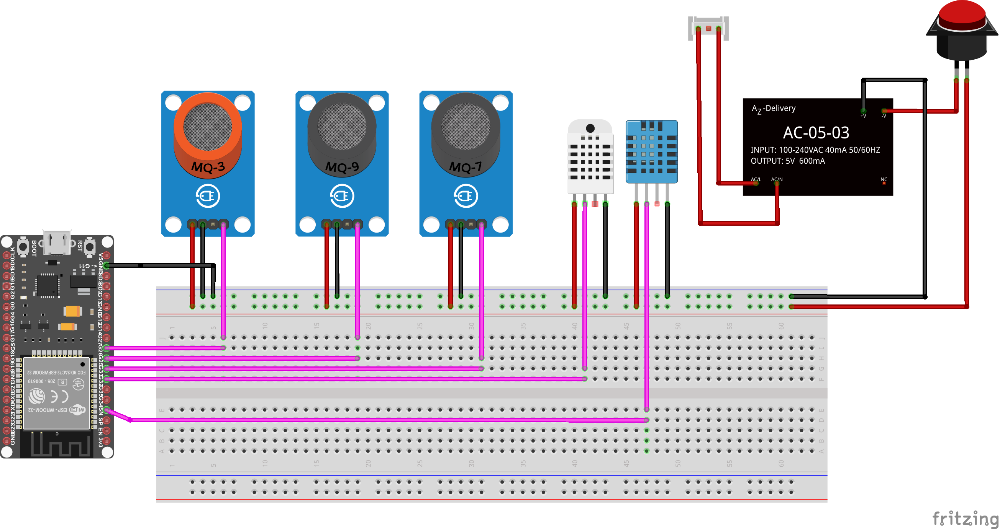

# Monitoring Carbon Footprint
Measuare and visualize carbon emissions, using IoT Technology .

 

### What is Climate ?
Climate can be different for different seasons. Although, we can defined climate as the usual weather of a place. It is normal to have different climates. Nevertheless, we have to know what is normal. You're probably thinking, how do we know when the Earth's climate is normal ? To answer this , we have to understand what Climate change is.

### Climate Change.
Climate change is a change in the usual weather found in a place. The changes can be experienced in a number of ways. For instance ,the increase in the climate's temperature or 
sudden decrease in rainfall in a place could be a result of climate change.Infact, what's more important, is how changes in the earth's temeparature affects how we live on it. 

### This Project !
In this little repo ,we measure how much Carbondioxide is emitted from a common emittant "Automobiles" using CO2 Sensors. The data collected from this project
is used along with Total distance travalled 
and ambient temperature. Thereafter, we can analyze the data to make meaning out of it.


## Prerequisite 
As you Naviagate through this repository, you should be familiar with PHP , MQSQL , C , HTML ,CSS and Thingspeak.

#### SQL
```SQL
CREATE TABLE SensorData (
    id INT(6) UNSIGNED AUTO_INCREMENT PRIMARY KEY,
    sensor1 VARCHAR(30) NOT NULL,
    location VARCHAR(30) NOT NULL,
    value1 VARCHAR(10),
    value2 VARCHAR(10),
    value3 VARCHAR(10),
    value4 VARCHAR(10),
    reading_time TIMESTAMP DEFAULT CURRENT_TIMESTAMP ON UPDATE CURRENT_TIMESTAMP
)
```

## Getting Started !


- [ ] Purchase the ESP32/8266/NodeMCU module,MQ9, MQ3, MQ7,MQ135 Sensor, Hi-Link Module (220 to 5v DC).
- [ ] Install the Arduino IDE - Use the link below to download the Arduino IDE.

```
https://www.arduino.cc/en/software
```
- [ ] Add the Link To "Preferences" in The Arduino IDE !
Open Arduino IDE ----> File ---> Preferences --->Additional Boards Mananger URLs

```
https://dl.espressif.com/dl/package_esp32_index.json,http://dan.drown.org/stm32duino/package_STM32duino_index.json,%20http://arduino.esp8266.com/stable/package_esp8266com_index.json
```

## Product Desgin Details
See Breadboarding, Schematic , PCB Design and Bill of Materials Below


## Breadboarding
See breadboarding in the figure below. The ESP32 was not connected to it's default powersource (usb mini). 
We assume the esp is powered with a voltage "VIN" pin directly from the Hi-Link module. Because unfortunately the esp32 
is not built with a VIN pin unlike the nodeMCU.

 
